## <p align="center">Пример создания автотестов для [сайта](https://www.tezis-doc.ru/)<br/>системы электронного документооборота </p>
В данном проекте представлен пример создания UI автотестов для web-версии сайта https://www.tezis-doc.ru.<br/>
Тестируемая функциональность - элементы модуля "Header главной страницы":
- Title главной страницы;
- Логотип;
- Пункты основных разделов сайта;
- Кнопка и поле поиска;
- Контактный телефон;
- Форма обратного звонка.
---
### Использованный технологический стек
 `Java` 
 `Selenide` 
 `JUnit` - написание исходного кода;<br/>

 `Gradle` 
 `Jenkins` - сборка и запуск автотестов на удаленном билд-сервере;<br/>

 `Selenoid` 
 `Docker` - запуск автотестов в изолированных сессиях на билд-сервере;<br/>
 `Allure Report` - формирование отчетности по итогам тестирования;<br/>
 `Allure TestOps` - создание тестовой документации.


---
### Конфигурация для запуска тестов
Параметры для запуска автотестов в удаленном браузере на билд-сервере проекта [autotests.cloud](https://selenoid.autotests.cloud/) задаются в настройках job CI Jenkins в виде **Choice Parameter** и передаются в код проекта через терминал как системные переменные (в фигурных скобках) с помощью следующих команд:

```
clean
test
-Dbrowser=${BROWSER} // запускаемый браузер
-DbrowserVersion=${BROWSER_VERSION} // версия браузера
-DbrowserSize=${BROWSER_SIZE} // размер окна браузера
-DremoteDriverUrl=https://<username>:<password>@${REMOTE_DRIVER_URL}/wd/hub/ // URL сервера, на котором запускаются тесты
-DvideoStorage=https://${REMOTE_DRIVER_URL}/video/ // URL сервера с видеофайлами выполнения тестов
-Dthreads=${THREADS} // число потоков для прогона тестов
```
Другой вариант передачи параметров - из файла remote.properties, расположенного по пути `src/test/resources/config/remote.properties`. Для этого вместо установки **Choice Parameter** в настройках Jenkins создается шаг сборки **Create/Update Text File** с созданием текстового файла, содержащего конфигурационные данные:<br/><br/>
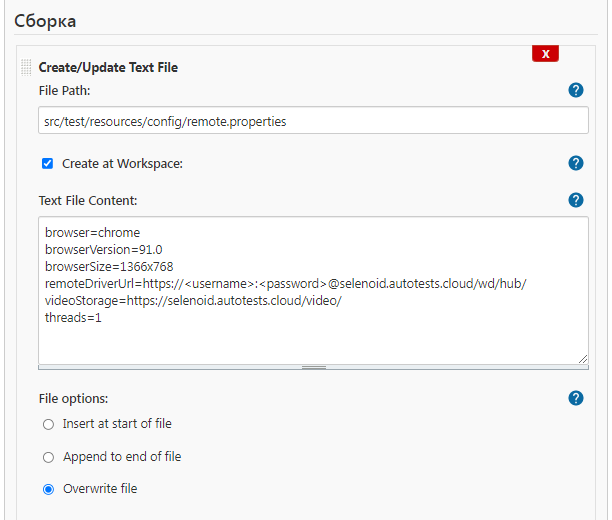<br/><br/>
При этом в терминал передается только команда `clean test`.


В данном проекте прогон автотестов производился со следующими параметрами:<br/>
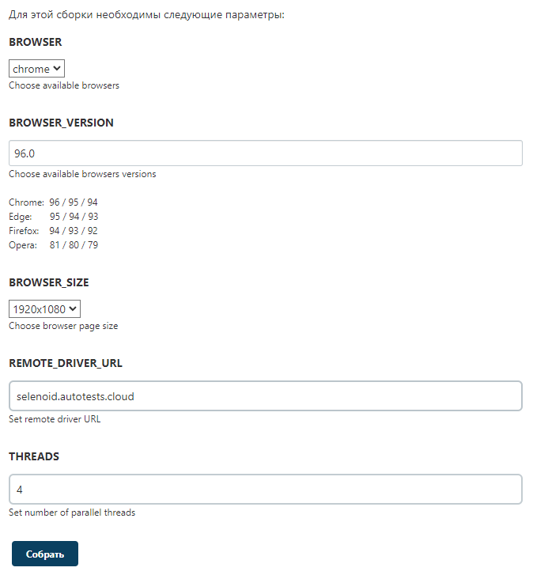

---
### Интеграция с Allure Report и Allure TestOps
Результаты выполнения сборки Allure Report формируются в директории `build/allure-results`<br/><br/>
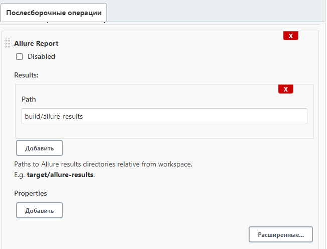<br/><br/>
Интеграция с Allure TestOps задается в настройках среды сборки<br/><br/>
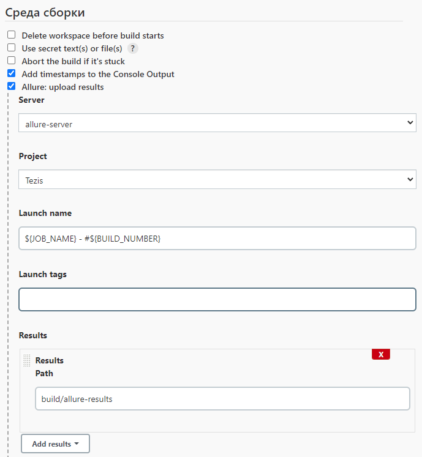

---
### Настройка оповещений
Для настройки рассылок оповещений о результатах прогона тестов в мессенджеры, например, Telegram и Slack, используется приложение jar приложение из репозитория проекта [Allure notifications](https://github.com/qa-guru/allure-notifications/releases). В настройках послесборочных операций Jenkins job добавлен **Post Buil Task** со скриптом, который проверяет наличие jar-файла allure-notifications в корне репозитория проекта и, при его отсутствии, скачивает данный файл из репозитория https://github.com/qa-guru/allure-notifications/releases
```
cd ..
FILE=./allure-notifications-${ALLURE_NOTIFICATIONS_VERSION}.jar
if [ ! -f "$FILE" ]; then
   wget https://github.com/qa-guru/allure-notifications/releases/download/${ALLURE_NOTIFICATIONS_VERSION}/allure-notifications-${ALLURE_NOTIFICATIONS_VERSION}.jar
fi
```
Также в настройках сборки добавлены шаги сборки **Create/Update Text File** для создания json-файлов, содержащих идентификационные данные приложений-ботов и чатов в мессенджерах, в которые производится отправка оповещений. Для каждого мессенджера создан **Post Buil Task** со скриптом, который запускает рассылку оповещений:

```
java "-DprojectName=${JOB_NAME}" "-Denv=<enviroment>" "-DreportLink=${BUILD_URL}" "-Dcomm=<some comment>" "-Dconfig.file=./src/test/resources/notifications/<messenger name>.json" -jar ../allure-notifications-{ALLURE_NOTIFICATIONS_VERSION}.jar
```
---
### Результаты прогона тестов


### Сборка Jenkins
:arrow_right: [**Jenkins Job**](https://jenkins.autotests.cloud/job/08-parenkov-fedor-tezis-doc/) :arrow_left:

---
### Отчет в Allure Report
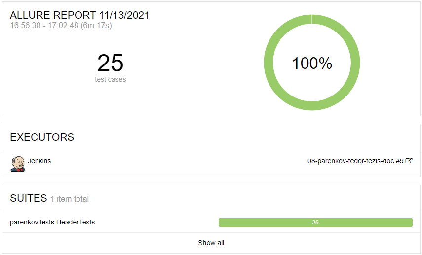
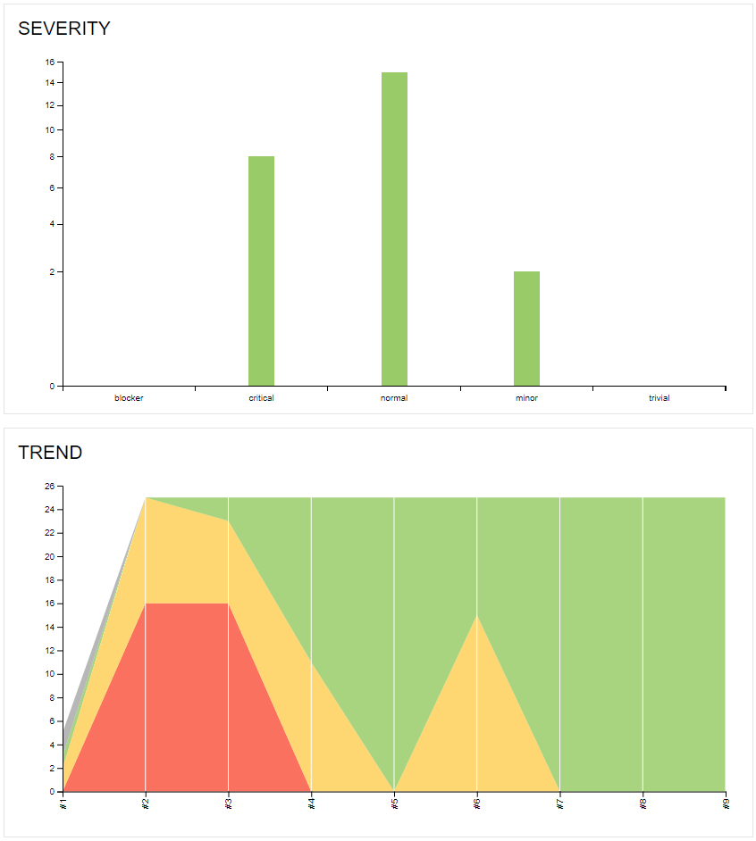
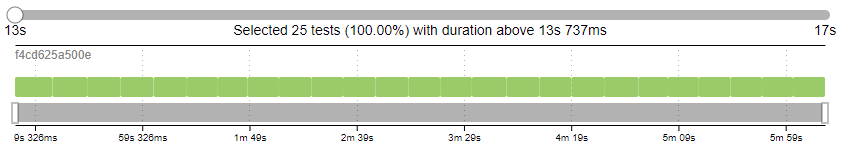

---
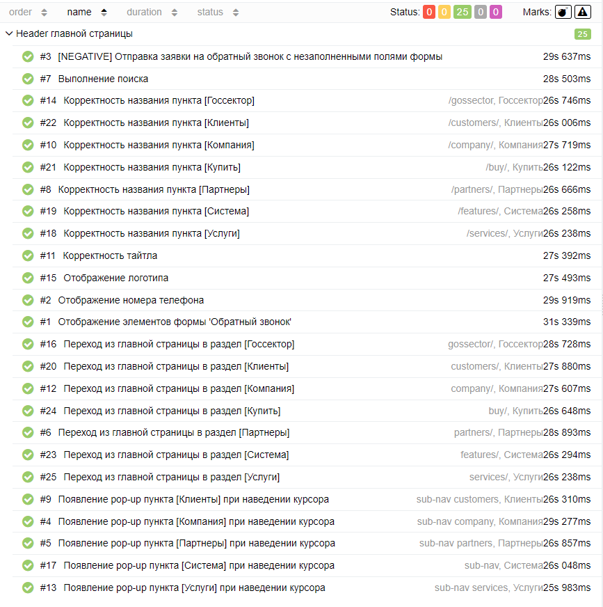
---
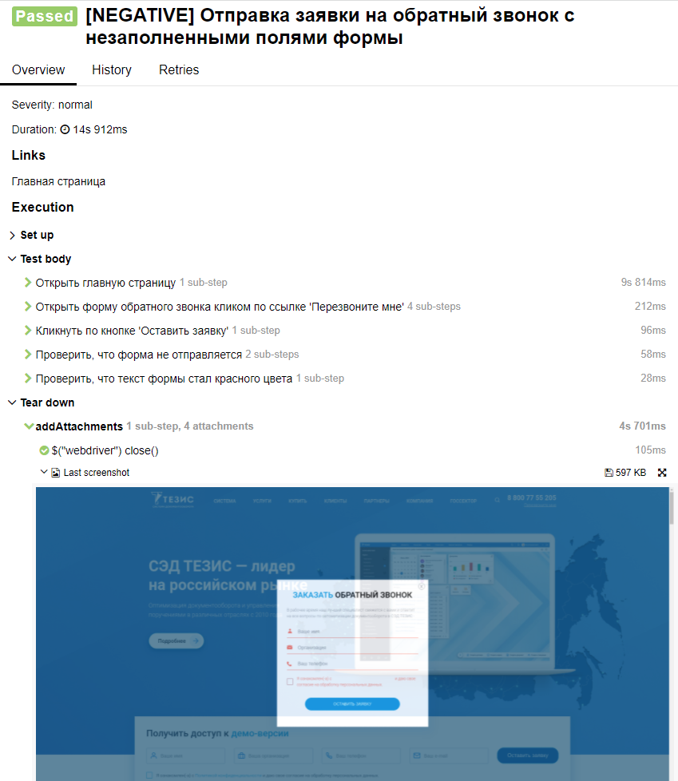

---
### Видео работы тестов<br/><br/>
**[NEGATIVE] Отправка заявки на обратный звонок с незаполненными полями формы**<br/><br/>
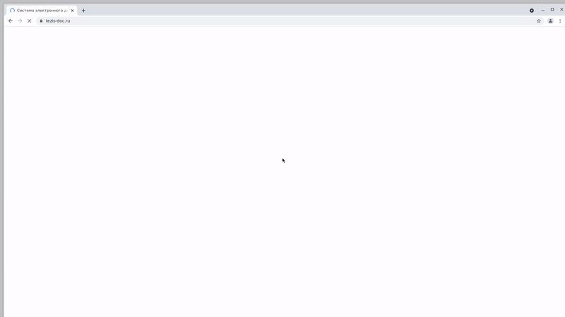

---
**Переход из главной страницы в раздел Клиенты**<br/><br/>
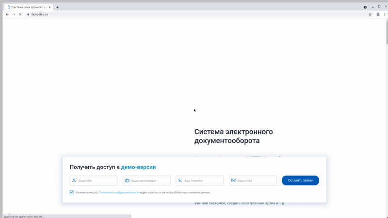

---
**Появление pop-up пункта Система при наведении курсора**<br/><br/>
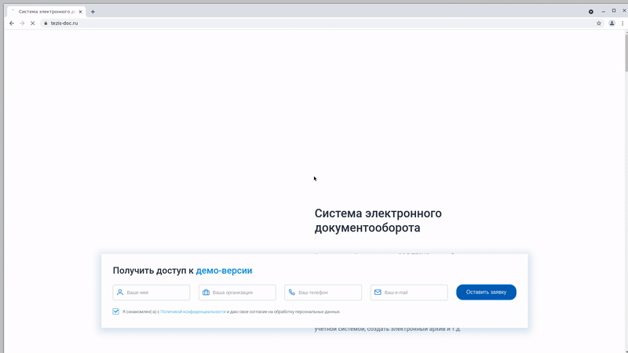

---
**Выполнение поиска**<br/><br/>
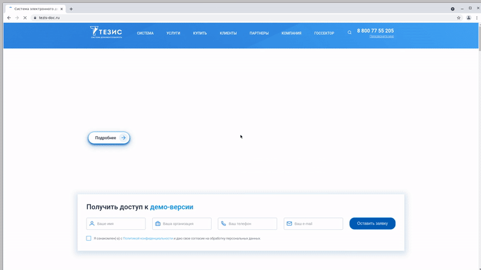

---
### Оповещения о статусе сборки в мессенджерах
<br/>
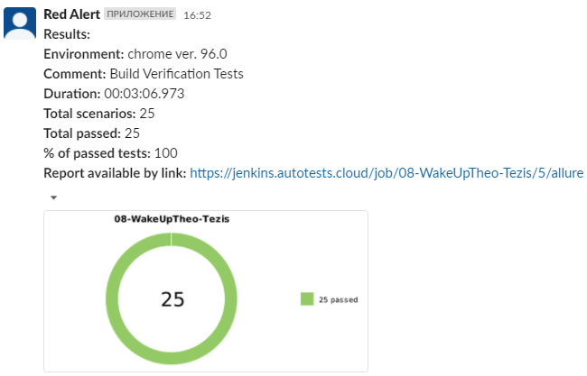
---
<br/>


---
### Тестовая документация, сгенерированная в Allure TestOps по итогам прогона тестов
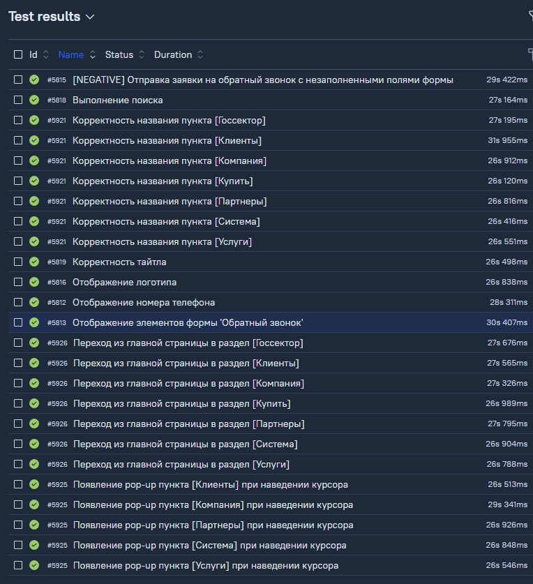<br/><br/>
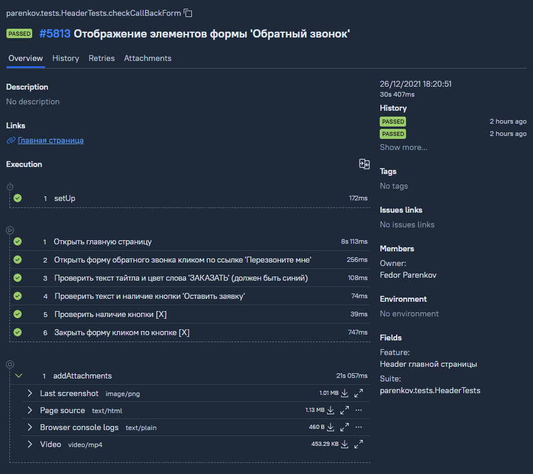
