## Автоматизация UI тестов на примере [сайта](https://www.tezis-doc.ru/) системы электронного документооборота 
В данном проекте представлен пример UI автотестов для web-версии сайта https://www.tezis-doc.ru.<br/>
Тестируемая функциональность - элементы модуля **Header главной страницы**:
- Title главной страницы;
- Логотип;
- Пункты основных разделов сайта;
- Кнопка и поле поиска;
- Контактный телефон;
- Форма обратного звонка.
---
### Использованный технологический стек
 `Java` 
 `Selenide` 
 `JUnit` - написание исходного кода;<br/>
 `Gradle` - сборка проекта;<br/>
 `Jenkins` - конфигурация и запуск сборок;<br/>
 `Selenoid` 
 `Docker` - запуск автотестов в изолированных сессиях на билд-сервере;<br/>
 `Allure Report` - формирование отчетности по итогам тестирования;<br/>
 `Allure TestOps` - создание тестовой документации;<br/>
 `Jira` - создание задачи в таск-трекере.


---
### Конфигурация для запуска тестов
Для запуска автотестов сконфигурирована :arrow_right: **[job](https://jenkins.autotests.cloud/job/08-WakeUpTheo-Tezis/)** :arrow_left: в CI Jenkins. В Jenkins job добавлена интеграция с Allure Report и Allure TestOps, а также настроена расслылка оповещений о результатах выполнения тестов в мессенджеры Slack и Telegram.<br/>
Параметры для запуска автотестов в удаленном браузере на билд-сервере проекта [autotests.cloud](https://selenoid.autotests.cloud/) задаются в виде **Choice Parameter** в настройках job и передаются в код проекта через терминал как системные переменные с помощью следующих команд:

```
clean
test
-Dbrowser=${BROWSER} // запускаемый браузер
-DbrowserVersion=${BROWSER_VERSION} // версия браузера
-DbrowserSize=${BROWSER_SIZE} // размер окна браузера
-DremoteDriverUrl=https://<login>:<password>@${REMOTE_DRIVER_URL}/wd/hub/ // URL сервера, на котором запускаются тесты
-DvideoStorage=https://${REMOTE_DRIVER_URL}/video/ // URL сервера с видеофайлами выполнения тестов
-Dthreads=${THREADS} // число потоков для прогона тестов
```
Другой вариант передачи параметров - из файла remote.properties, расположенного по пути `src/test/resources/config/remote.properties`. Для этого вместо установки **Choice Parameter** в настройках Jenkins создается шаг сборки **Create/Update Text File** с созданием текстового файла, содержащего конфигурационные данные:<br/><br/>
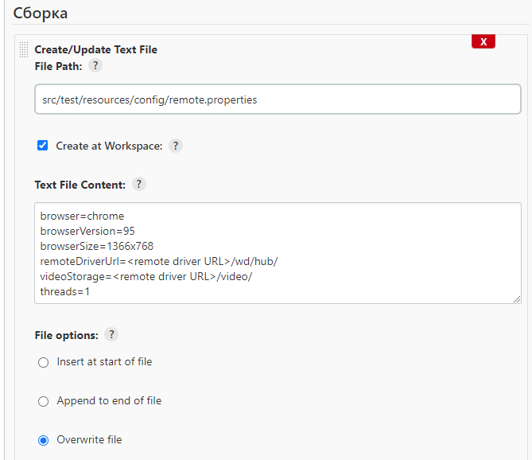<br/><br/>
При этом в терминал передается только команда `clean test`.


Запуск автотестов производился со следующими параметрами:<br/><br/>
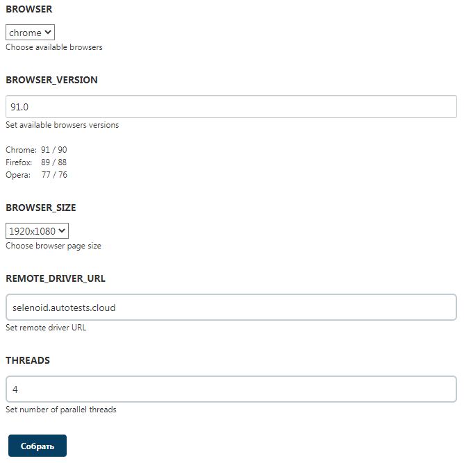

---
### Интеграция с [Allure Report](https://docs.qameta.io/allure-report/) и [Allure TestOps](https://docs.qameta.io/allure-testops/)
Результаты выполнения сборки для Allure Report формируются в директории `build/allure-results`<br/><br/>
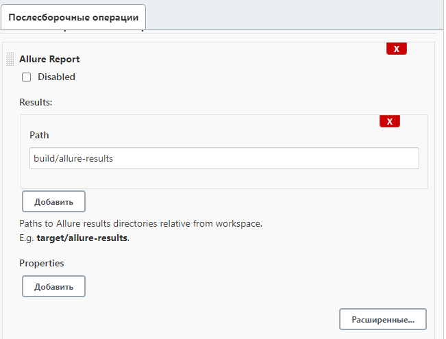<br/><br/>
Интеграция с Allure TestOps задается в настройках среды сборки<br/><br/>
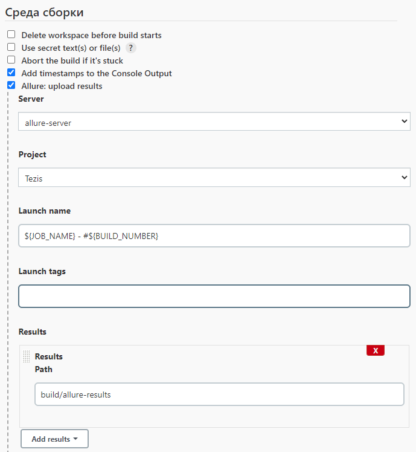

---
### Результаты выполнения тестов


### Отчет в Allure Report
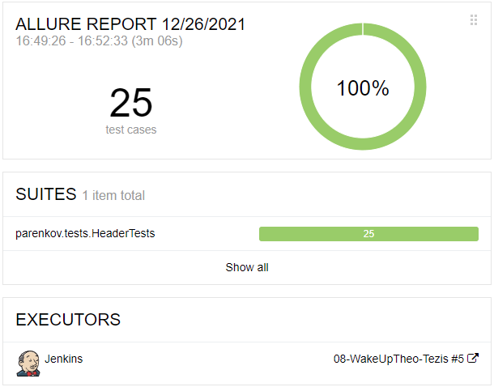
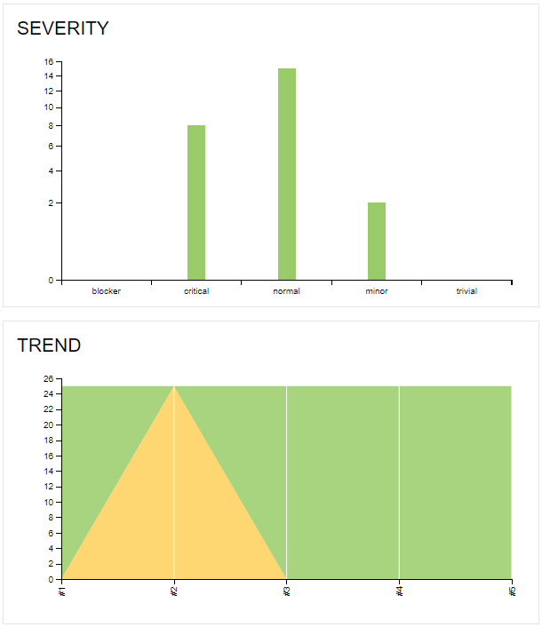
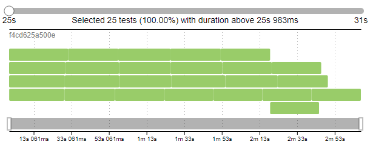

---
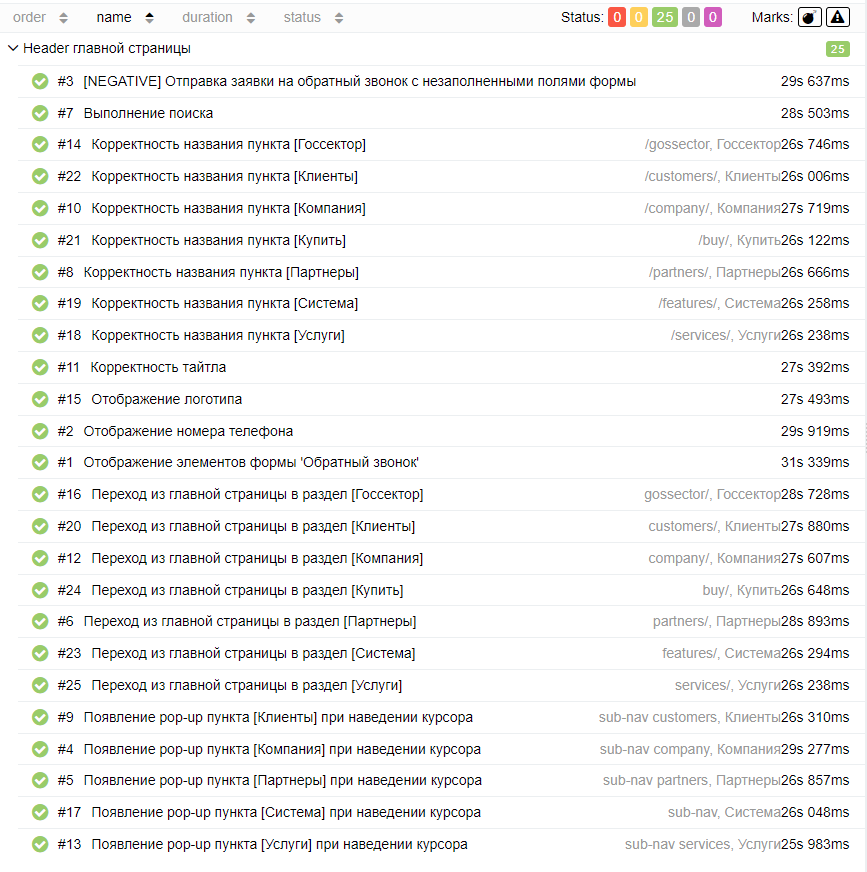
---
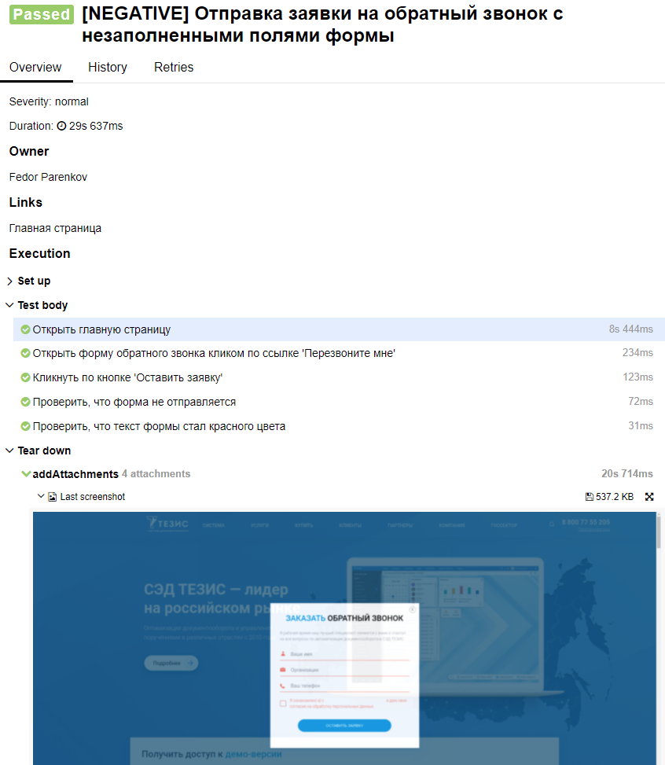

---
### Видео работы тестов<br/><br/>
**[NEGATIVE] Отправка заявки на обратный звонок с незаполненными полями формы**<br/><br/>
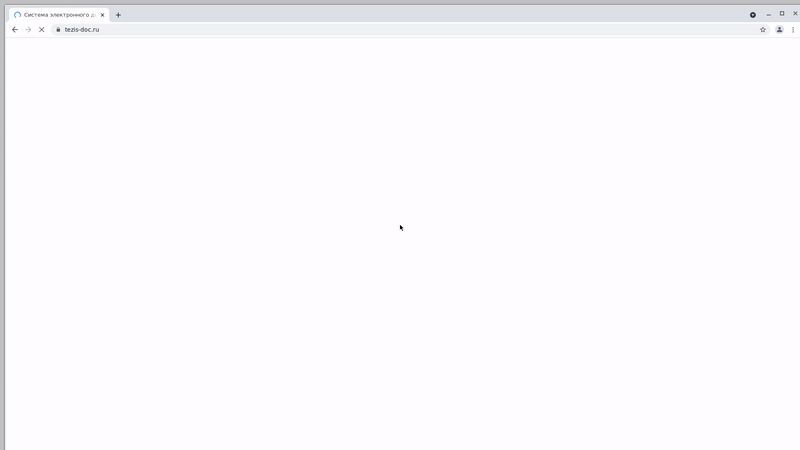

---
**Переход из главной страницы в раздел Клиенты**<br/><br/>
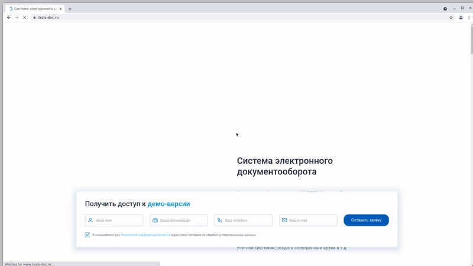

---
**Появление pop-up пункта Система при наведении курсора**<br/><br/>
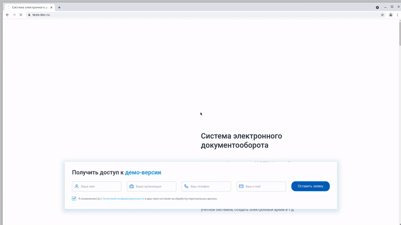

---
**Выполнение поиска**<br/><br/>
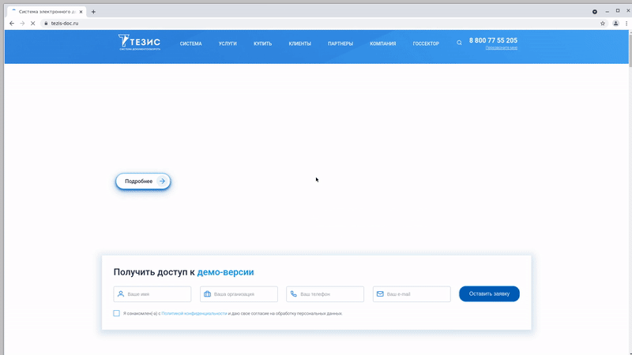

---
### Оповещения о статусе сборки в мессенджерах
<br/>
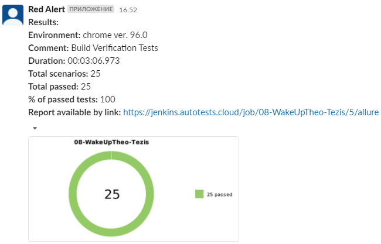
---
<br/>
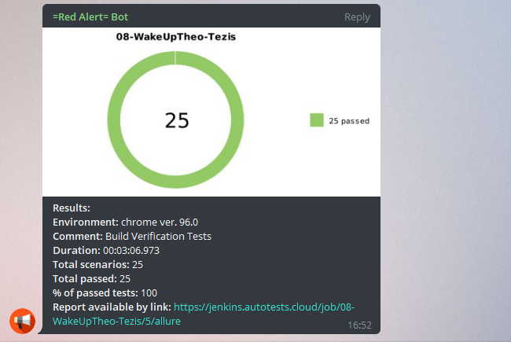

---
### Тестовая документация, сгенерированная в [Allure TestOps](https://allure.autotests.cloud/project/670/dashboards) по итогам прохождения тестов
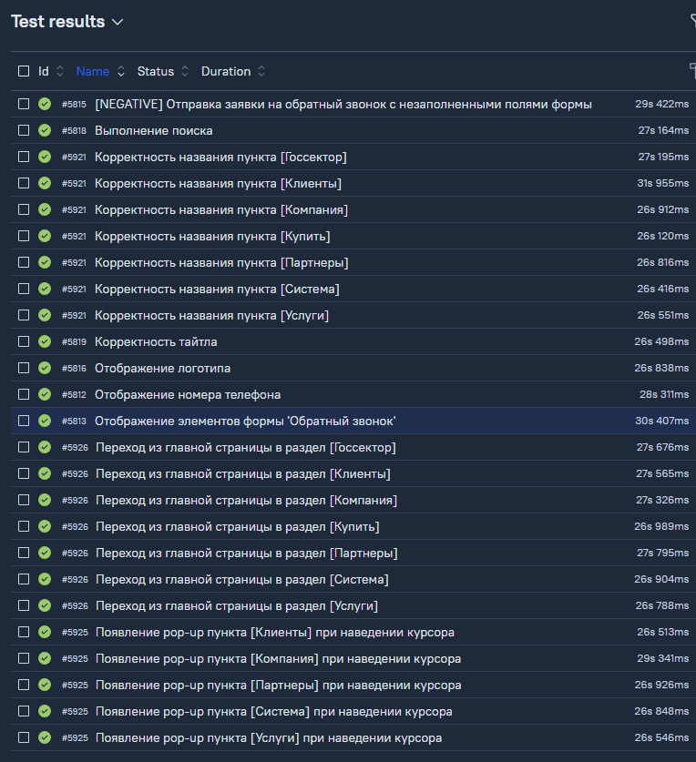<br/><br/>
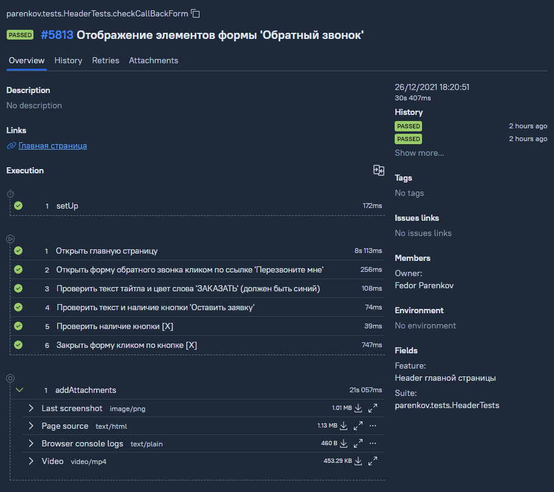

### [Задача](https://jira.autotests.cloud/browse/HOMEWORK-293) в таск-трекере Jira с данными, экспортированными из Allure TestOps
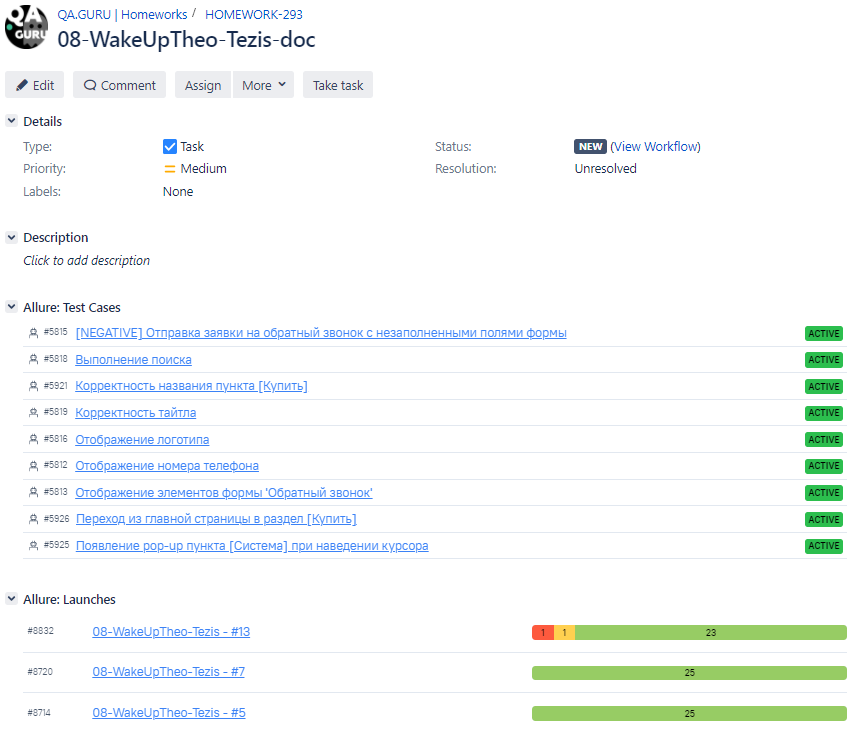
